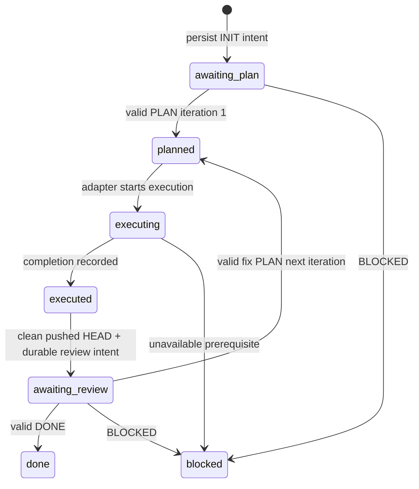

# Planner–Executor Protocol

Status: PARTIAL — Stage A candidate. Canonical target wire version 2; current implementation is legacy version 1. No implicit mixed-version parsing is allowed. Core is provider-, OS- and transport-neutral.

## Envelope and identities

Canonical marker: `[PLANNER_BRIDGE]`. Header order: VERSION, STATE, TASK_ID, ITERATION, WORKSPACE_ID, optional HEAD, optional IN_REPLY_TO, OPERATION_ID. Version is 2. IDs are non-secret bounded opaque strings; new task IDs use `pb_` plus at least 128 bits of cryptographic randomness. WORKSPACE_ID comes from the Execution World, not a path. OPERATION_ID is stable for a logical outgoing message; it grants no authority.

Maximum envelope UTF-8 bytes: 8192; section: 4096; header: 512. Duplicate fields, unrecognized fields/sections, empty required values, unsupported version, multiline header, unsafe integer and excess byte size are rejected. Reject multiple candidate envelopes rather than choosing a stale envelope opportunistically. Normalize CRLF; preserve section content/blank lines. Hash the canonical UTF-8 serialization for idempotency; don't hash credentials or evidence bodies.

HEAD is a full Git object ID (40 or 64 hexadecimal digits for the fixture's repository object format), verified through the active GitLease. It is required on EXECUTED, REVIEW and every review reply. TASK_ID, ITERATION, WORKSPACE_ID and HEAD must all match the pending round before state or review acceptance changes.

| Message | Sender | Sections | Identity constraints |
|---|---|---|---|
| INIT | Executor orchestrator | GOAL, INSTRUCTION | iteration 0; workspace required |
| PLAN | Planner/Reviewer | GOAL, RATIONALE, ACTIONS, FILES_LIKELY_INVOLVED, TESTS, SUCCESS_CRITERIA | initial iteration 1, IN_REPLY_TO 0; fix plan uses next execution iteration |
| EXECUTED | Executor orchestrator | RESULT, CHANGED_FILES, TESTS, NOTE | current execution iteration; clean pushed HEAD required |
| REVIEW | Executor orchestrator | FOCUS | same immutable EXECUTED identity and HEAD; no authority extension |
| DONE | Reviewer | SUMMARY | exact submitted execution iteration/HEAD; IN_REPLY_TO matches |
| BLOCKED | either | REASON, NEEDS | exact pending round; HEAD required if reviewing |
| ERROR | either | REASON | exact pending round; diagnostic, never success |

INIT is bootstrap; EXECUTING is a local execution state rather than a required wire message. REVIEW can be combined with EXECUTED as one outgoing review request; they must not cause two duplicate submissions. Planner/Reviewer and Executor are logical roles, not vendor names encoded in the core.

## State machine

For execution iteration n, EXECUTED and DONE use n. A fix PLAN uses n+1 and IN_REPLY_TO n; it cannot be executed twice. Initial PLAN uses 1. Errors and cancellation retain the pending task identity and an explicit recovery condition; they never implicitly advance an iteration. Persist accepted reply identity/digest and atomic revision before returning control to the Executor. Re-applying an identical accepted reply returns the stored outcome; a conflicting reply is rejected.

## Retry, replay and timeout

Persist outbound intent and operation ID before browser mutation; phases are prepared, sending, observed-sent, awaiting-reply, accepted, uncertain. A crashed sending operation is uncertain until independently reconciled with the same conversation and exact visible user envelope. The old 30-second in-memory cooldown is insufficient.

Same operation ID/same digest returns the recorded delivery/result without a new Enter. Same ID/different digest fails `REPLAY_CONFLICT`. A new operation ID must not duplicate a task/round send. Sidecar restart, RPC timeout or missing acknowledgement is not proof that no message was sent. If the exact outgoing message cannot be confirmed or disproved, return `SEND_UNCERTAIN`; do not auto-resend. Fail-closed uncertainty may require human recovery but must preserve task/iteration/HEAD.

Waits have explicit bounded deadlines and cancellation. RPC observation timeout and model reply timeout are different errors. Reconnect reads persisted round/baseline/delivery facts, reacquires current workspace capabilities, then resumes the same wait. It does not create a new INIT or duplicate EXECUTED. Cancellation cancels the pending request; it cannot revoke an already sent message. Owned composer cleanup is separate from caller abort and bounded. A fresh browser target or navigation epoch invalidates handles and requires reconciliation before resumed use.

## Exact-HEAD and evidence

Before REVIEW, GitLease must prove a non-protected branch, clean worktree, configured upstream, zero ahead/behind, local HEAD equal to upstream HEAD and submitted HEAD. Revalidate at reply acceptance to reject post-submission mutations. The Reviewer independently reads source, Git and the task/iteration-scoped execution_output channel. Proof values are never in the outgoing envelope or tool review arguments.

The disposable fixture prints a random successful `E2E_EVIDENCE` nonce only to captured execution output. Reviewer SUMMARY must echo the latest successful nonce and exact identity. The acceptance observer compares against execution evidence independently; Executor completion prose, fabricated bools or same-process fakes cannot satisfy the gate. Production core must not hardcode this fixture nonce requirement into generic protocol semantics.

## Compatibility

Legacy `[D2C]` v1, sender names, `d2c_` task IDs, storage records and existing public tools may remain behind explicit adapters. A task's protocol version is durable and cannot change midway through a pending round. Existing v1 task recovery uses the v1 validator; new canonical tasks use v2. Compatibility parsing cannot weaken workspace/HEAD checks. Map old error/status aliases only at public edges. Development CodexWithChatGPT control syntax is externally owned and not a product wire protocol.
