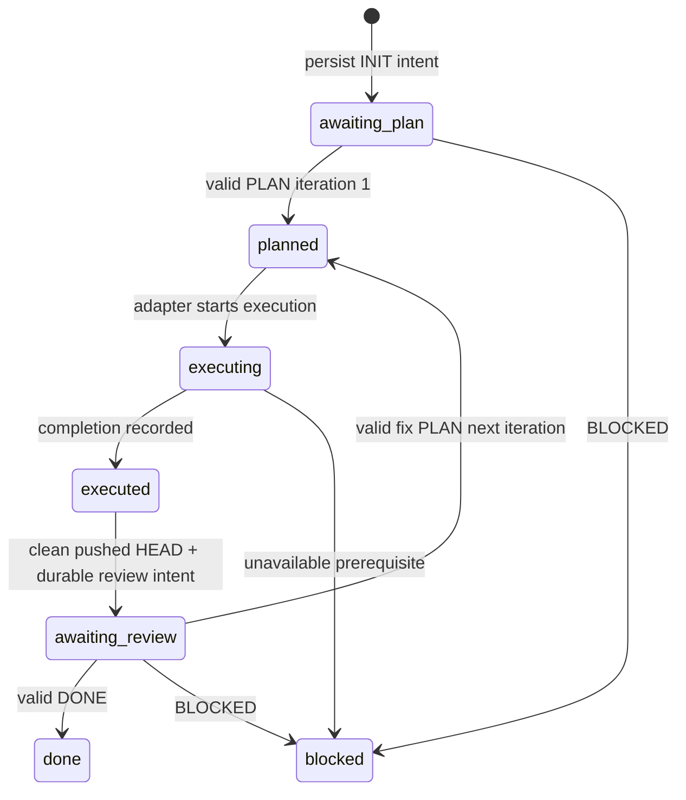

# Planner–Executor Protocol

Status: PARTIAL — Stage A candidate. Canonical target wire version 2; current implementation is legacy version 1. No implicit mixed-version parsing is allowed. Core is provider-, OS- and transport-neutral.

## Envelope and identities

Canonical marker: `[PLANNER_BRIDGE]`. Header order: VERSION, STATE, TASK_ID, ITERATION, WORKSPACE_ID, optional HEAD, optional IN_REPLY_TO. Version is 2. IDs are non-secret bounded opaque strings; new task IDs use `pb_` plus at least 128 bits of cryptographic randomness. WORKSPACE_ID comes from the Execution World, not a path. IN_REPLY_TO is semantic reply-round correlation. Internal delivery operation IDs and HTTP request IDs never enter this model envelope and grant no authority.

Maximum envelope UTF-8 bytes: 8192; section: 4096; header: 512. Duplicate fields, unrecognized fields/sections, empty required values, unsupported version, multiline header, unsafe integer and excess byte size are rejected. Reject multiple candidate envelopes rather than choosing a stale envelope opportunistically. Normalize CRLF; preserve section content/blank lines. Hash the canonical UTF-8 serialization for idempotency; don't hash credentials or evidence bodies.

HEAD is a full Git object ID (40 or 64 hexadecimal digits for the fixture's repository object format), verified through the active GitLease. It is required on EXECUTED and every review reply. TASK_ID, ITERATION, WORKSPACE_ID and HEAD must match the pending round before acceptance changes; a fix PLAN names the next execution iteration and acknowledges the submitted review iteration. Canonical replies contain exactly one complete envelope with no surrounding prose or code fences; multiple target markers reject.

| Message | Sender | Sections | Identity constraints |
|---|---|---|---|
| INIT | Executor orchestrator | GOAL, INSTRUCTION | iteration 0; workspace required |
| PLAN | Planner/Reviewer | GOAL, RATIONALE, ACTIONS, FILES_LIKELY_INVOLVED, TESTS, SUCCESS_CRITERIA | initial iteration 1, IN_REPLY_TO 0; fix plan uses next execution iteration |
| EXECUTED | Executor orchestrator | RESULT, CHANGED_FILES, TESTS, NOTE | current execution iteration; clean pushed HEAD required |
| DONE | Reviewer | SUMMARY | exact submitted execution iteration/HEAD; IN_REPLY_TO matches |
| BLOCKED | either | REASON, NEEDS | exact pending round; HEAD required if reviewing |
| ERROR | either | REASON | exact pending round; diagnostic, never success |

INIT is bootstrap. EXECUTING and REVIEW/awaiting-review are local workflow phases. EXECUTED is the single outgoing message requesting review for a round; no separate REVIEW envelope or optional second send exists. Planner/Reviewer and Executor are logical roles, not vendor names encoded in the core.

## State machine
Each section delimiter is a standalone uppercase `NAME:` line preceded by an empty separator line. Bodies cannot contain delimiter-shaped lines (including unknown names); serialization rejects ambiguous bodies rather than turning body text into another section. Leading, internal and trailing body blank lines are preserved. Required sections are GOAL for INIT, ACTIONS for PLAN, RESULT for EXECUTED, SUMMARY for DONE, and REASON for BLOCKED/ERROR; other listed sections are optional.

The additive v2 codec is available through the protocol export. The production coordinator remains v1 until durable version selection and recovery are integrated; codec verification alone does not satisfy the production protocol gate.

For execution iteration n, EXECUTED and DONE use n. A fix PLAN uses n+1 and IN_REPLY_TO n; it cannot be executed twice. Initial PLAN uses 1. Errors and cancellation retain the pending task identity and an explicit recovery condition; they never implicitly advance an iteration. Persist accepted reply identity/digest and atomic revision before returning control to the Executor. Re-applying an identical accepted reply returns the stored outcome; a conflicting reply is rejected.

## Retry, replay and timeout

Protocol version is fixed at task creation. Unfinished released v1 tasks stay on the v1 adapter across restart; new v2 tasks never fall back to v1 after a parse/identity error. Before sending EXECUTED and before accepting its review, reacquire a fresh GitLease and revalidate exact clean/pushed HEAD. Changed HEAD rejects acceptance without advancing the round.

Protocol reply replay uses a canonical envelope digest persisted with the accepted result. Delivery idempotency lives outside the envelope: persist an internal ControlOperation and outbound intent before browser mutation; phases are prepared, sending, observed-sent, awaiting-reply, accepted, uncertain. A crashed sending operation is uncertain until reconciled with the same conversation and exact visible user envelope. The old 30-second in-memory cooldown is insufficient.

Same operation ID/same digest returns the recorded delivery/result without a new Enter. Same ID/different digest fails `REPLAY_CONFLICT`. A new operation ID must not duplicate a task/round send. Sidecar restart, RPC timeout or missing acknowledgement is not proof that no message was sent. If the exact outgoing message cannot be confirmed or disproved, return `SEND_UNCERTAIN`; do not auto-resend. Fail-closed uncertainty may require human recovery but must preserve task/iteration/HEAD.

Waits have explicit bounded deadlines and cancellation. RPC observation timeout and model reply timeout are different errors. Reconnect reads persisted round/baseline/delivery facts, reacquires current workspace capabilities, then resumes the same wait. It does not create a new INIT or duplicate EXECUTED. Cancellation cancels the pending request; it cannot revoke an already sent message. Owned composer cleanup is separate from caller abort and bounded. A fresh browser target or navigation epoch invalidates handles and requires reconciliation before resumed use.

## Exact-HEAD and evidence

Before REVIEW, GitLease must prove a non-protected branch, clean worktree, configured upstream, zero ahead/behind, local HEAD equal to upstream HEAD and submitted HEAD. Revalidate at reply acceptance to reject post-submission mutations. The Reviewer independently reads source, Git and the task/iteration-scoped execution_output channel. Proof values are never in the outgoing envelope or tool review arguments.

The disposable fixture prints a random successful `E2E_EVIDENCE` nonce only to captured execution output. Reviewer SUMMARY must echo the latest successful nonce and exact identity. The acceptance observer compares against execution evidence independently; Executor completion prose, fabricated bools or same-process fakes cannot satisfy the gate. Production core must not hardcode this fixture nonce requirement into generic protocol semantics.

## Compatibility

### Reply observation foundation

An optional internal `ReplyObservationBaseline` contains a version, conversation
identity, assistant count, SHA256 text digest and opaque document observation
epoch. It contains no assistant body and is never serialized into a model
envelope. The shared driver can capture it, refuse a changed baseline before
input, and restore observation after driver reconstruction while rejecting a
different conversation/document. Sidecar send/wait requests accept this bounded
metadata; both in-memory and durable operation digests include it, so changing it
on replay is a conflict. Legacy requests without it retain their existing digest.

The original foundation did not expose baseline capture through the Sidecar or
resume a journal wait. The journal-bound extension below adds those capabilities;
coordinator task-state integration remains pending.
The existing uncertainty policy remains unchanged. A changed document/target
requires explicit semantic reconciliation; an epoch mismatch cannot authorize
resending. New-task bootstrap and whole-browser restart remain integration work.

The internal driver now offers explicit read-only reconciliation using the
conversation and outgoing control SHA256 digest. Shared current/legacy message
observations must prove a unique latest configured-App user message before a
new document baseline is adopted. Missing, foreign or ambiguous evidence yields
`SEND_UNCERTAIN`; successful reconciliation resumes observation without typing
or Enter. Reconciliation remains an internal driver capability, not a generic
browser RPC.

### Journal-bound reply recovery

The neutral Sidecar client can capture the bounded reply baseline. Opt-in sends
with a known conversation persist their control digest, original baseline and
task/iteration/workspace/HEAD binding. A wait may reference that send with internal
`replyRecovery.sendOperationId`; the server derives proof inputs from its own
journal rather than accepting a caller-supplied outgoing digest. Missing source
records, changed bindings or changed replay metadata cannot authorize observation.
Released calls without this metadata keep their original digest and behavior.

After service restart, an uncertain wait or an uncertain source send requires
exact read-only outgoing-message reconciliation. The derived preceding count,
digest and conversation must match the original baseline; only then may its new
document epoch be used to resume waiting. No send is invoked during this path.
Wait acceptance and the reply SHA256 digest are published together. Replaying an
accepted wait after restart independently reobserves its reply and checks that
digest; it never invents a reply from journal acceptance alone. The journal keeps
no control or reply bodies. New-chat bootstrap, durable coordinator state and
whole-product recovery/crash-matrix acceptance remain integration work.

Legacy `[D2C]` v1, sender names, `d2c_` task IDs, storage records and existing public tools may remain behind explicit adapters. A task's protocol version is durable and cannot change midway through a pending round. Existing v1 task recovery uses the v1 validator; new canonical tasks use v2. Compatibility parsing cannot weaken workspace/HEAD checks. Map old error/status aliases only at public edges. Development CodexWithChatGPT control syntax is externally owned and not a product wire protocol.

### Canonical task aggregate foundation

The canonical task domain optionally stores one nested round with stable send/wait
IDs, outgoing SHA256 digest, original baseline, phase and submitted Git metadata.
Task lifecycle, accepted canonical reply digest and bounded validated protocol
sections are published through the same expected-revision task replacement.
The released v1 schema remains unchanged; roundless v2 foundation records remain
roundless rather than gaining invented delivery history.

Pending intent identity is immutable. Prepared, sending, observed-sent,
awaiting-reply and uncertain records cannot skip straight to acceptance; an
accepted result must reconstruct a valid canonical planner envelope, match its
digest, task/round/workspace/submitted HEAD and resulting lifecycle. The next
EXECUTED round uses the accepted PLAN iteration. Pending history cannot be
removed through administrative save/delete. Accepted replay cannot change the
result. A bootstrap route change is structurally permitted only with the
sending-to-observed-sent transition; this rule does not itself prove browser ACK.

This is a schema/repository foundation, not a running canonical coordinator.
It does not acquire fresh Git authority, verify browser delivery, turn crashed
sending records into uncertainty, or authorize read-only reconciliation. Those
use cases still require coordinator/transport integration. The Sidecar journal
continues to retain only delivery metadata, while the task aggregate retains
validated PLAN/review sections so a restart can return the accepted instructions
without persisting a raw website response or transcript. No new RPC or model
wire field is introduced here.
