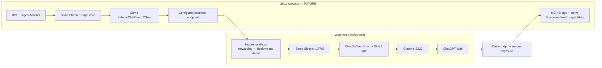
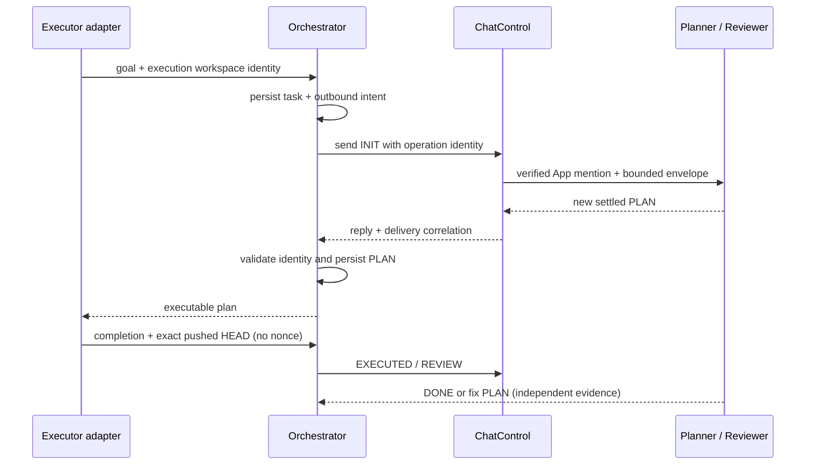
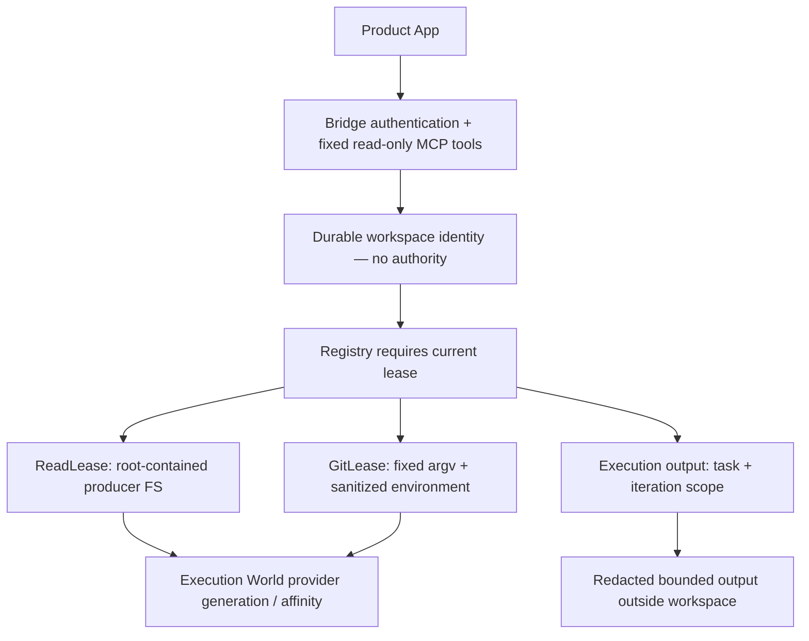
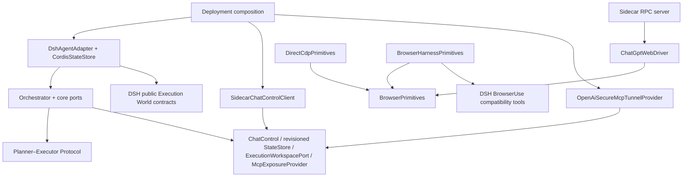

# PlannerBridge target architecture

Status: PARTIAL — design candidate for Stage A independent review. This is the canonical target, not a claim about implemented behavior. `goal.md` defines scope; `env-win.md` records dated observations. Older documents describe the legacy implementation until explicitly migrated.

PlannerBridge is a provider-neutral Planner/Reviewer ↔ Executor collaboration runtime. The first deployment uses ChatGPT Web and Windows DSH with DeepSeek-V4.1-Flash. The repository/package may retain their existing names for installation compatibility. CodexWithChatGPT is exclusively a development tool.

## Windows primary topology

```mermaid
flowchart LR
  D[Windows DSH / DeepSeek Executor] --> A[DshAgentAdapter]
  A --> O[PlannerBridge orchestrator]
  O --> C[SidecarChatControlClient]
  C --> S[Chat Control Sidecar :18765]
  S --> W[ChatGptWebDriver]
  W --> P[DirectCdpPrimitives]
  P --> B[Dedicated Chrome :9222]
  B --> G[ChatGPT Web Planner / Reviewer]
  G --> APP[Product Custom App]
  APP --> E[Secure MCP exposure]
  E --> M[Loopback MCP Bridge]
  M --> R[WorkspaceRuntimeRegistry]
  R --> L[Active ReadLease / GitLease / evidence scope]
```

Chrome and Sidecar listen exclusively on loopback. MCP Bridge also listens exclusively on loopback; exposure authenticates the external App and injects the Bridge bearer only on the final local hop. The primary profile does not mount Browser Harness or require its executable.

## Future cross-host topology

The Linux client never addresses remote CDP, a Windows path, or SSH. Forwarding configuration is outside the semantic RPC and protocol. No Linux automation is in current scope.

## Control plane

ChatControl owns conversation operations, not workspace facts or Git. ChatGptWebDriver owns exact App selection, draft ownership, reply baseline fencing, streaming/settling, logout detection, cancellation and recovery. Browser primitives own target selection, DOM observation and input. The same semantic driver is used with Direct CDP and compatibility Browser Harness primitives; duplicate DOM algorithms are forbidden.

## Workspace Data Plane

Retain `workspace/runtime.ts`, producer-owned leases and their containment guarantees. Never turn workspace ID into a Host path, or replace an unavailable lease with Node filesystem/subprocess access. Durable records contain identity and workflow facts, never live lease handles. Restart requires reacquisition from the current execution provider before content reads.

## Ports and dependency DAG

Suggested modules: `core/ports`, `protocol`, `orchestrator`, `chat-control`, `chat-control/web-driver`, `chat-control/primitives`, `sidecar`, `adapters/dsh`, `adapters/mcp-exposure`. Directory creation follows tests, not speculative scaffolding.

| Boundary | Contract | Forbidden dependency |
|---|---|---|
| Protocol | strict neutral envelopes and pure transitions | DSH, Cordis, browser, CDP, OS, SSH, tunnel implementation |
| Orchestrator | workflow, durable state, correlation | Browser Harness/Chrome concrete adapters, Cordis lifecycle |
| ChatControl | health, ensureReady, openConversation, sendControlMessage, waitForReply, recover, currentConversation | workspace, shell, Git, evidence bodies |
| StateStore | asynchronous get/put/delete plus atomic task transition operation | production memory fallback |
| ExecutionWorkspacePort | identity and operation-scoped capabilities | inferred authority or Host fallback |
| DshAgentAdapter (inbound) | invokes neutral plan/review/status/recover application use cases; tool/prompt wiring, session cwd and execution observations | core importing DSH/Cordis lifecycle |
| McpExposureProvider | start/health/rebind/stop under exclusive ownership | influencing protocol identity or granting content access |
| BrowserPrimitives | internal typed DOM/input/target operations | exported generic browser RPC |

Existing `StateStore` supplies an asynchronous seam. The target transition contract loads a task aggregate with a monotonic revision and commits a replacement only against its expected revision. Task state, accepted reply digest and outbound intent share that one aggregate and commit point; revision conflict rejects without publication. One active DSH writer per state store is supported, enforced by a process ownership lock before mounting tools. This is not a distributed lock. CordisStateStore implements this port separately from inbound DshAgentAdapter and preserves released storage versions through explicit adapters/migration. No core import points outward into DSH.

Workspace Data Plane owns Bridge schemas, bearer binding, registry and lease lifetimes. McpExposureProvider receives an already-created loopback MCP endpoint and a private secret reference, and owns only start/health/rebind/stop. Exposure health grants no content authority. ExecutionWorkspacePort acquires identity and operation-scoped read/Git/evidence capabilities; adapters retain producer leases rather than reconstructing them.

ChatGptWebDriver owns the single DOM/App/composer/reply algorithm. BrowserPrimitives supplies target identity/navigation epoch, navigation, DOM evaluation, focus, text/key/click input, target activation and mutation waiting. Generic evaluation/CDP is internal to this boundary, never a Sidecar RPC method. BrowserHarnessChatControl composes this same driver over Session-gated BrowserHarnessPrimitives; DirectCdpPrimitives is primary.

Product state directories are deployment-injected private paths outside all workspaces. Missing secure state location fails startup; production cannot fall back to process.cwd(). The Windows Sidecar default is :18765, configurable to another literal-loopback port; no core contract fixes this port.

## Ownership and lifecycle

One active control operation owns the product conversation and composer; incompatible concurrent requests fail `BUSY`. Ownership includes target identity, navigation epoch and known draft text/App atom. Human/Executor browser input is not globally locked; any changed ownership fails closed and preserves the foreign draft. Cleanup is allowed only on a still-owned draft and uses a separate bounded shutdown signal after caller cancellation.

The DSH adapter acquires execution identity/read/Git capabilities per operation; it installs Bridge access for that lease lifetime and disposes it in all paths. Exposure reserves exclusive workspace ownership before setup, promotes it after durable task creation, and releases only a matching terminal owner or proven task-absent reservation.

Sidecar owns only its narrow browser session and its own authentication/replay/delivery journal, stored outside workspaces. It has no workspace handle and no filesystem/shell/Git API. DSH task/outbound state and the Sidecar journal are separate stores with no cross-process transaction. Recovery reconciles them; neither alone proves browser delivery. Persist minimal operation IDs, digests, conversation/target fingerprints, send phase and reply baseline; avoid durable message bodies where unnecessary. Bound retained terminal entries by count, bytes and age; never silently evict unresolved sends or allow an evicted ID to authorize re-entry. Full unresolved journal fails new admission until explicit reconciliation.

On startup: validate config/auth → health → target binding → semantic readiness → reacquire capability → reconcile durable outbound operation → resume wait. On shutdown: reject new operations → cancel/drain current request → bounded owned-draft cleanup → disconnect browser → revoke live capabilities → stop exposure → close listeners. Uncertain sends remain uncertain after shutdown.

## Failure domains and recovery

| Failure | Required response |
|---|---|
| Bad protocol identity/version/reply HEAD | reject before state mutation; preserve pending operation |
| App unavailable/logout/ambiguous composer | no message send; typed fail-closed error |
| Caller abort | promptly stop normal work; bounded owned cleanup; no extra Enter |
| Sidecar disconnect/restart | reload journal and rebind target; reconcile, never blindly resend |
| Chrome reload/target disappearance | invalidate DOM handles/baselines; reopen known conversation and reconcile |
| DSH restart | restore exact task/iteration/HEAD; reacquire current provider lease |
| Exposure failure | no fabricated App readiness; preserve protocol/task state |
| Provider replacement | invalidate old read/Git/evidence capability immediately |
| Send occurred but acknowledgement was lost | inspect exact visible user envelope; otherwise return SEND_UNCERTAIN and require explicit recovery, not automatic resend |

RPC request ID, internal ControlOperation ID and model protocol identity are distinct. ControlOperation contains a stable logical ID, canonical message digest, intended conversation and task/iteration/workspace/HEAD correlation; its ID is never a wire-envelope header or authority. RPC retries can use a new request ID for the same operation. Same request ID/payload joins the in-flight result or returns its recorded disposition; changed payload rejects. Same operation ID/digest reconciles or returns the recorded result without Enter; a new ID cannot duplicate an existing task/round. Restart-safe reconciliation is a gate, not a claim of exactly-once Web UI delivery.

WorkspaceRuntimeRegistry's current generation Symbol and acquisition token are consumer-local stale-publication fences, not producer generation metadata. Producer ReadLease/GitLease enforce actual captured provider affinity, lifecycle and cancellation. Preserve both layers and discard results if either authority is revoked; durable state never serializes a live generation or lease.

All core contracts, protocol, state machine, Sidecar client and Web semantics are OS-independent. Chrome location/profile paths, Windows ACL provider, process launcher and future forwarding are deployment adapters. Concrete Windows evidence is required; Linux status remains FUTURE.

## Current baseline and staged ownership

2026-10-01 source baseline at `5d303f5`: 403 passed / 3 skipped / 1 failed. The existing cancellation cleanup test fails at `browser.spec.ts:168`; cleanup currently reuses the cancelled caller signal. Stage A remains PARTIAL after architecture fix PLAN against draft `46abd15`. Immediately after architecture DONE, establish regression coverage and fix ownership-safe bounded cleanup in a separate reviewed commit, before Stage B ports extraction or any abstraction restructuring. No product source is modified during Stage A.

Stages B–I follow `acceptance-plan.md`; every stage uses falsification tests → implementation → checks → independent commit → exact-HEAD ChatGPT review. Producer changes require a failing consumer test and prior independent architecture review. Architecture changes require updating this contract and review before implementation.
